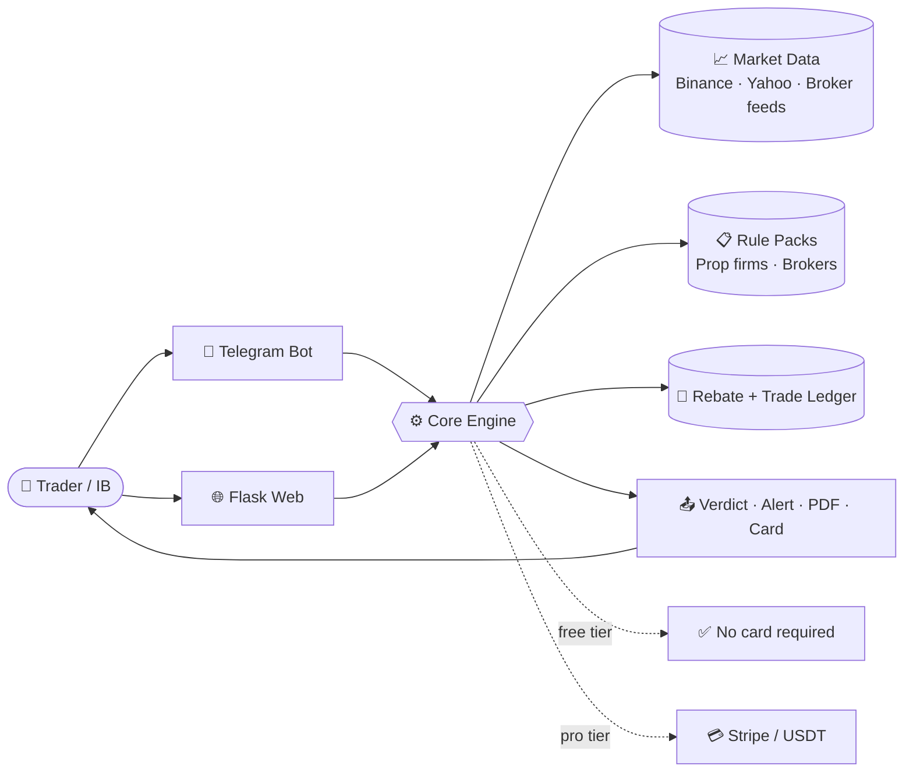
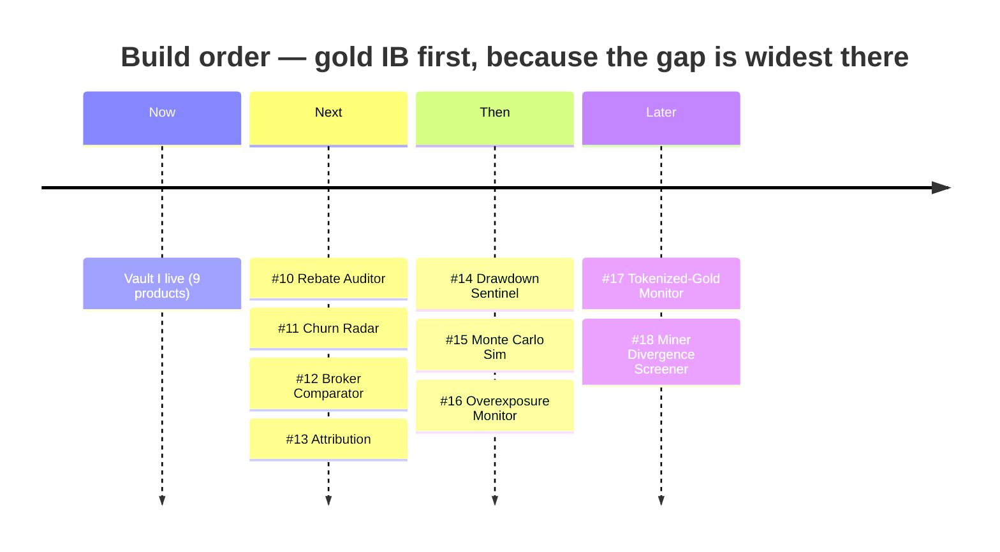

<div align="center">

<picture>
  <source media="(prefers-color-scheme: dark)" srcset="assets/hero-banner-dark.svg">
  <source media="(prefers-color-scheme: light)" srcset="assets/hero-banner-light.svg">
  
</picture>

<br><br>


<br><br>

<a href="#-the-vault--9-shipped"></a>
<a href="#-vault-ii--9-proposed"></a>
<a href="#-platforms--free-tiers"></a>
<a href="#-roadmap"></a>
<a href="#-quickstart"></a>

<br><br>


</div>

<br>

> [!IMPORTANT]
> **Educational research only. Not financial advice.** Every price, spread, and payout figure is indicative — verify with your broker before acting. Nothing here is a solicitation to trade, and no product guarantees a result.


<br>

## ⚡ What This Is

Eighteen small, sharp tools for people who make money **around** trading, not only from it — introducing brokers, prop-challenge traders, signal buyers, and gold watchers.

Every product follows the same shape: **one job, one command or one page, a free tier that needs no card, and a paid tier that only sells time and scale.** Nine are shipped. Nine are proposed, weighted hard toward the gold-IB business, which is where the demand is loudest and the supply is thinnest.




<br>

## 🏆 The Vault — 9 Shipped

<div align="center">

| | | |
|:--:|:--:|:--:|
| <br>**Gold Watch Alert**<br>🤖 Telegram | <br>**XAUUSD Verifier**<br>🤖 Telegram | <br>**Prop Calculator**<br>🤖🌐 Both |
| <br>**Scam Detector**<br>🤖 Telegram | <br>**Gold Calendar**<br>🤖🌐 Both | <br>**Copy-Trade Audit**<br>🤖 Telegram |
| <br>**Red-Flag Scanner**<br>🤖🌐 Both | <br>**IB Revenue Calc**<br>🌐 Web | <br>**Influencer Audit**<br>🤖 Telegram |

</div>

<br>

<details>
<summary><b>🥇 #1 · Gold Watch Alert Bot</b> &nbsp;—&nbsp; 🤖 Telegram &nbsp;·&nbsp; <i>free, unlimited</i></summary>

<br>

**Problem** — Traders miss gold entries to spread and slippage. Most Telegram gold channels are scams.

**Solution** — `/watch XAUUSD style mode`, moved from PRO to **free**. Binance `PAXGUSDT` primary, Yahoo `GC=F` fallback. Spread-aware stops from existing constants.

**Platform** — 🤖 Telegram. The whole product is one command in, one alert out. No page needed.

**Free tier** — `/watch` on gold, unlimited, no account.

**Upsell** — `/autopilot` plus DCF/COT fundamentals as PRO.

</details>

<details>
<summary><b>🥇 #2 · XAUUSD Signal Verifier</b> &nbsp;—&nbsp; 🤖 Telegram &nbsp;·&nbsp; <i>free single verify</i></summary>

<br>

**Problem** — Gold signal sellers post fabricated MT4 screenshots with cherry-picked entries.

**Solution** — `/verify GOLD PRICE` pulls Binance `PAXGUSDT` tick history and tests the claimed fill. Returns **VERDICT: REAL / IMPOSSIBLE** with the gap percentage and a plain-language reason.

**Platform** — 🤖 Telegram. Verification happens inside the group where the fake was posted — that is the point.

**Free tier** — one verify per request, unlimited requests.

**Upsell** — PRO batch CSV upload and weekly audit reports.

</details>

<details>
<summary><b>🏛 #3 · Prop Firm Challenge Calculator</b> &nbsp;—&nbsp; 🤖🌐 Both &nbsp;·&nbsp; <i>full calculator free</i></summary>

<br>

**Problem** — Traders pay $500–$5,000 in challenge fees with no expected-value estimate, and roughly 90% fail. Hidden rules sit buried in the T&Cs.

**Solution** — Flask calculator plus `/propcalc FEE SIZE PASS%`. Computes EV and scans pasted T&Cs for hidden rules with red/yellow scoring.

**Platform** — 🤖🌐 Both. Web takes the long T&C paste; the bot answers the quick "is this worth it" question.

**Free tier** — full calculator and bot command, no limit.

**Upsell** — premium PDF audit and automated forecast.

</details>

<details>
<summary><b>🔒 #4 · Telegram Bot Scam Detector</b> &nbsp;—&nbsp; 🤖 Telegram &nbsp;·&nbsp; <i>free scans</i></summary>

<br>

**Problem** — Fake verification bots, malware links, and fake airdrops rose sharply through 2025.

**Solution** — `/audit @bot_username` checks for private-key requests, unregulated broker pushes, and missing audit links. Returns a **SCAM SCORE** and a checklist.

**Platform** — 🤖 Telegram. It audits Telegram bots, so it lives where its targets live.

**Free tier** — unlimited `/audit` scans.

**Upsell** — PRO daily auto-scan of subscribed channels plus a malware database.

</details>

<details>
<summary><b>🥇 #5 · Gold Seasonality Calendar</b> &nbsp;—&nbsp; 🤖🌐 Both &nbsp;·&nbsp; <i>calendar + PDF free</i></summary>

<br>

**Problem** — Traders ignore gold seasonality — Fed windows, CME holidays, jewelry cycles — and the spread-widening events around them.

**Solution** — Web calendar at `/gold-calendar` showing monthly volatility patterns and Fed release windows, with PDF download. Bot pushes `/calendar_alert` 30 minutes ahead.

**Platform** — 🤖🌐 Both. The calendar is a page you scan; the alert is a push you cannot miss.

**Free tier** — full calendar and PDF, no login.

**Upsell** — PRO real-time alert bot.

</details>

<details>
<summary><b>🔒 #6 · Copy-Trade Safety Audit</b> &nbsp;—&nbsp; 🤖 Telegram &nbsp;·&nbsp; <i>5 free audits</i></summary>

<br>

**Problem** — Influencers push unregulated copy-trading; users lose capital to hidden spreads and blowouts.

**Solution** — `/copyaudit BROKER` checks regulation (SEC/FCA/ASIC links) and negative-balance protection, and prices the hidden spread cost. Returns **SAFE / HIGH RISK** with a checklist.

**Platform** — 🤖 Telegram. Runs at the moment someone is being pitched.

**Free tier** — 5 audits.

**Upsell** — PRO unlimited plus a weekly portfolio risk report.

</details>

<details>
<summary><b>💱 #7 · Forex Signal Red-Flag Scanner</b> &nbsp;—&nbsp; 🤖🌐 Both &nbsp;·&nbsp; <i>free text scan</i></summary>

<br>

**Problem** — Signal sellers claim "100% accuracy", delete losing trades, flood fake reviews, and charge $30–$300 a month.

**Solution** — Web scanner plus `/scan TEXT`. NLP flags "guaranteed", "no risk", "VIP spots left", and checks for verified audit links (MyFXBook / FX Blue).

**Platform** — 🤖🌐 Both. Paste a pitch on the web, or forward a message to the bot.

**Free tier** — unlimited text scans.

**Upsell** — PRO full group auto-scan and a weekly scorecard.

</details>

<details>
<summary><b>🥇 #8 · IB Affiliate Revenue Calculator</b> &nbsp;—&nbsp; 🌐 Web &nbsp;·&nbsp; <i>free calculator</i></summary>

<br>

**Problem** — IB affiliates face opaque payout rules and compliance overhead, and referred clients complain about buggy platforms and slow withdrawals.

**Solution** — Web calculator at `/ib-calc` estimating net revenue after compliance cost and payout timeline, with a downloadable compliance checklist.

**Platform** — 🌐 Web. Multi-field model plus a document download — a bot would fight the form.

**Free tier** — full calculator and checklist.

**Upsell** — PRO automated monthly forecast and audit template.

</details>

<details>
<summary><b>🔒 #9 · Influencer Trading Scam Audit</b> &nbsp;—&nbsp; 🤖 Telegram &nbsp;·&nbsp; <i>free audit + template</i></summary>

<br>

**Problem** — Billions are lost to social-media investment scams each year, and a large share of short-form "financial advice" is misleading.

**Solution** — `/audit @influencer_handle` demands audited trading history rather than screenshots, flags rented luxury props, and checks unregulated broker promotions. Ships a free **loss report template** for FTC / CFTC / IC3.

**Platform** — 🤖 Telegram. Viral by construction — the audit gets forwarded into the group that shared the influencer.

**Free tier** — unlimited audits plus the loss-report template.

**Upsell** — PRO batch audit and an automated scam-alert channel.

</details>


<br>

## 🔮 Vault II — 9 Proposed

The shipped nine are almost all **defensive** — auditors, verifiers, red-flag scanners — plus two static calculators. Nothing yet serves an introducing broker's *actual daily operations*. Vault II fixes that, weighted **4 gold IB / 2 prop / 1 forex / 1 crypto / 1 stocks**.

Scored on what matters: how badly people want it, versus how little exists today.

<div align="center">

| | # | Product | Vertical | Platform | Free tier | Demand | Supply gap | Effort |
|:--:|:--|:--|:--|:--|:--|:--|:--|:--|
|  | **10** | Rebate Reconciliation Auditor | 🥇 Gold IB | 🌐 + 🤖 ping | 1 broker · 1 month | `●●●●●` | `○○○○○` | ●●○ |
|  | **11** | IB Client Churn & Blow-Up Radar | 🥇 Gold IB | 🤖🌐 Both | 10 clients | `●●●●○` | `○○○○○` | ●●● |
|  | **12** | Live Gold Broker Comparator | 🥇 Gold IB | 🤖🌐 Both | fully open | `●●●●○` | `●●○○○` | ●●○ |
|  | **13** | IB Link Attribution Tracker | 🥇 Gold IB | 🌐 + `/newlink` | 3 links | `●●●○○` | `●○○○○` | ●●○ |
|  | **14** | Drawdown Sentinel | 🏛 Prop | 🤖 Telegram | 1 account · 1 firm | `●●●●●` | `●○○○○` | ●●● |
|  | **15** | Monte Carlo Challenge Sim | 🏛 Prop | 🌐 + `/simulate` | 1,000 sims | `●●●●○` | `●●○○○` | ●○○ |
|  | **16** | Correlation & Overexposure | 💱 Forex | 🤖🌐 Both | snapshots | `●●●●○` | `●●○○○` | ●●○ |
|  | **17** | Tokenized-Gold Premium Monitor | 🪙 Crypto | 🤖 + web chart | unlimited | `●●●○○` | `○○○○○` | ●○○ |
|  | **18** | Miner–Bullion Divergence Screener | 📈 Stocks | 🌐 + digest | weekly screen | `●●●○○` | `●○○○○` | ●●○ |

<sub>`●` demand = how loudly it is asked for &nbsp;·&nbsp; `○` supply gap = how little exists (more `○` = emptier market) &nbsp;·&nbsp; effort = build weeks</sub>

</div>

<br>

<details>
<summary><b>🥇 #10 · Rebate Reconciliation Auditor</b> &nbsp;—&nbsp; 🌐 Web-first &nbsp;·&nbsp; <b>the biggest gap in the set</b></summary>

<br>

**Problem** — Brokers underpay IB rebates and quietly change per-lot rates. Almost no IB reconciles, because doing it by hand across a few hundred accounts is miserable.

**Solution** — Upload the broker rebate statement CSV and the client trade log. Recompute `lots × rate` per symbol and account tier, diff it against what was actually paid, and flag shortfalls, missing accounts, and silent rate changes.

**Platform** — 🌐 Web-first: CSV upload, a diff table you can sort, PDF export. 🤖 Telegram companion pings when a new statement is reconciled.

**Free tier** — one broker, one month, full shortfall report. No card.

**Upsell** — multi-broker monthly auto-reconciliation and a dispute-letter generator.

**Data** — broker rebate statement, trade log export, IB tier schedule.

📄 [Full spec →](products/product-10.md)

</details>

<details>
<summary><b>🥇 #11 · IB Client Churn & Blow-Up Radar</b> &nbsp;—&nbsp; 🤖🌐 Both</summary>

<br>

**Problem** — IB revenue dies when the client book dies, and it dies quietly. By the time volume shows up flat in the monthly statement, the client is already gone.

**Solution** — Score every referred client on declining lot volume, rising margin utilisation, martingale and revenge-trade patterns, and dormancy drift. Output a 30-day churn or blow-up probability with a suggested intervention.

**Platform** — 🤖🌐 Both: web dashboard for the book, Telegram push the moment a client crosses a risk threshold.

**Free tier** — 10 tracked clients, unlimited alerts.

**Upsell** — unlimited clients and auto-drafted nurture messages.

📄 [Full spec →](products/product-11.md)

</details>

<details>
<summary><b>🥇 #12 · Live Gold Broker Comparator</b> &nbsp;—&nbsp; 🤖🌐 Both &nbsp;·&nbsp; <i>doubles as the IB's lead magnet</i></summary>

<br>

**Problem** — An IB has to justify which broker they route clients to, and clients have no way to compare the numbers that actually cost them money.

**Solution** — Live XAUUSD spread, swap long and short, commission, and observed slippage across a broker set, rendered as a ranked shareable card carrying the IB's referral link.

**Platform** — 🤖🌐 Both: a public indexable web table (the SEO asset) and `/goldspread`, which returns the card as an image straight into any group.

**Free tier** — public comparison table and bot command, fully open.

**Upsell** — white-label branded embeddable widget.

📄 [Full spec →](products/product-12.md)

</details>

<details>
<summary><b>🥇 #13 · IB Link Attribution & Funnel Tracker</b> &nbsp;—&nbsp; 🌐 Web</summary>

<br>

**Problem** — Broker portals report signups but never say where they came from, so an IB cannot tell which content earned the client.

**Solution** — Per-channel short links tracking post → click → signup → first deposit → first lot, closing the attribution hole the broker leaves open.

**Platform** — 🌐 Web link manager and funnel dashboard, with 🤖 `/newlink` and a daily conversion digest.

**Free tier** — 3 tracked links, full funnel view.

**Upsell** — unlimited links, cohort LTV, and payback period.

📄 [Full spec →](products/product-13.md)

</details>

<details>
<summary><b>🏛 #14 · Drawdown Sentinel (Rule Guardian)</b> &nbsp;—&nbsp; 🤖 Telegram-first</summary>

<br>

**Problem** — Most challenge failures are **rule breaches, not bad strategy** — a daily-loss line crossed by one trade, a news-window entry, a lot size over cap.

**Solution** — Real-time monitor of daily loss, trailing drawdown, news blackout windows, max lot, and consistency rules, driven by per-firm rule packs. It alerts *before* the breach, with an optional flatten webhook.

**Platform** — 🤖 Telegram-first. The entire value is a push arriving seconds before the line is crossed; the web side only links accounts and picks rule packs.

**Free tier** — 1 account on 1 firm, unlimited breach alerts.

**Upsell** — multi-account monitoring and auto-flatten.

📄 [Full spec →](products/product-14.md)

</details>

<details>
<summary><b>🏛 #15 · Monte Carlo Challenge Simulator</b> &nbsp;—&nbsp; 🌐 Web-first</summary>

<br>

**Problem** — Product #3 gives a static EV number, which hides the thing that actually kills accounts: path risk. A profitable edge still breaches a trailing drawdown on a bad sequence.

**Solution** — Simulate N equity paths against the *real* rule set — daily DD, trailing DD, minimum trading days, consistency rule — from the trader's own win rate, RR, and variance. Return a realistic pass probability and the expected total cost-to-funded across retries.

**Platform** — 🌐 Web-first for the equity-path fan chart and PDF, plus `/simulate` returning a summary card.

**Free tier** — 1,000 simulations per run, unlimited runs.

**Upsell** — 100k sims, full rule-pack library, PDF export.

📄 [Full spec →](products/product-15.md)

</details>

<details>
<summary><b>💱 #16 · Correlation & Overexposure Monitor</b> &nbsp;—&nbsp; 🤖🌐 Both</summary>

<br>

**Problem** — "Five open trades" is often one leveraged bet. XAUUSD, silver, DXY, USDJPY, and miners move together, and the account finds out during the drawdown.

**Solution** — Cluster open positions into a single true-risk figure, and surface swap-rollover and session-spread cost alongside it.

**Platform** — 🤖🌐 Both: web heat-map of the cluster, `/exposure` snapshot and overexposure warning in Telegram.

**Free tier** — on-demand snapshots, unlimited.

**Upsell** — live monitoring with prop-rule-aware exposure caps.

📄 [Full spec →](products/product-16.md)

</details>

<details>
<summary><b>🪙 #17 · Tokenized-Gold Premium & Payout Health Monitor</b> &nbsp;—&nbsp; 🤖 Telegram-first</summary>

<br>

**Problem** — PAXG and XAUT drift from spot XAU, and nobody watches the premium. Separately, traders taking IB and prop payouts in USDT get hit by chain fees, depeg moments, and address-poisoning attacks.

**Solution** — Track tokenized-gold premium and discount against spot, redemption fees, and reserve-attestation freshness. Add a payout-wallet health check: chain fee, depeg watch, address-poisoning detection.

**Platform** — 🤖 Telegram-first (`/paxg`, `/walletcheck`, depeg push) with a public web premium chart.

**Free tier** — live premium readout and wallet safety check, unlimited.

**Upsell** — arbitrage alerts and continuous wallet monitoring.

📄 [Full spec →](products/product-17.md)

</details>

<details>
<summary><b>📈 #18 · Miner–Bullion Divergence Screener</b> &nbsp;—&nbsp; 🌐 Web-first</summary>

<br>

**Problem** — Gold traders who want equity exposure are badly served. Generic stock screeners know nothing about AISC, and gold sites know nothing about equities.

**Solution** — Screen GDX, GDXJ, and royalty names for beta divergence against spot gold, AISC-versus-price margin compression, and earnings or halt risk.

**Platform** — 🌐 Web-first sortable screener, plus a 🤖 Telegram weekly digest.

**Free tier** — weekly screen, full table, no login.

**Upsell** — daily alerts and backtesting.

📄 [Full spec →](products/product-18.md)

</details>


<br>

## 📊 Platforms & Free Tiers

<div align="center">

<picture>
  <source media="(prefers-color-scheme: dark)" srcset="assets/metrics-3d-dark.svg">
  <source media="(prefers-color-scheme: light)" srcset="assets/metrics-3d-light.svg">
  
</picture>

</div>

<br>

Delivery is chosen by shape, never by taste:

| Shape of the job | Platform | Why |
|:--|:--|:--|
| Ad-hoc trigger, or an alert that must arrive | 🤖 **Telegram** | Zero install, mobile-native, and it spreads inside the groups these users already live in |
| CSV upload, dashboard, shareable link, PDF | 🌐 **Web (Flask)** | Forms and tables that a chat window would fight |
| Heavy view *and* time-critical push | 🤖🌐 **Both** | Web renders it, the bot warns you, one account links them |

<div align="center">

| Platform | Products | Count |
|:--|:--|:--:|
| 🤖 Telegram only | 1, 2, 4, 6, 9, 14, 17 | **7** |
| 🌐 Web only | 8, 10, 13, 15, 18 | **5** |
| 🤖🌐 Both | 3, 5, 7, 11, 12, 16 | **6** |
| ✅ **Free tier** | **all of them** | **18** |

</div>

> [!NOTE]
> **No product is paywalled at the door.** Every one of the eighteen does its core job for free, without a card. Paid tiers sell only *scale* (more clients, more sims, more brokers) and *automation* (continuous monitoring instead of on-demand).


<br>

## 🗺️ Roadmap

<div align="center">


</div>

- [x] **Vault I** — 9 products shipped
- [ ] **Gold IB ops suite** — #10 Rebate Auditor, #11 Churn Radar, #12 Broker Comparator, #13 Attribution
- [ ] **Prop + forex** — #14 Drawdown Sentinel, #15 Monte Carlo Sim, #16 Overexposure Monitor
- [ ] **Crypto + stocks** — #17 Tokenized-Gold Monitor, #18 Miner Divergence Screener
- [ ] Shared account linking Telegram identity to web sessions
- [ ] One billing spine (Stripe + USDT) across all eighteen




<br>

## 🚀 Quickstart

```bash
git clone https://github.com/printezy247/sambangold-products.git
cd sambangold-products
cp .env.example .env          # fill in your keys
pip install -r requirements.txt
python -m app                 # Flask web + Telegram polling
```

| Variable | Required | Purpose |
|:--|:--:|:--|
| `TELEGRAM_BOT_TOKEN` | ✅ | Bot identity for every 🤖 product |
| `STRIPE_API_KEY` | — | PRO tier checkout |
| `STRIPE_WEBHOOK_SECRET` | — | Subscription state sync |
| `USDT_ADDRESS` | — | Crypto payment path |
| `ADMIN_TELEGRAM_ID` | ✅ | Admin commands and alert routing |
| `EZYAI_SITE_URL` | — | Web base URL for shareable links |
| `SENTRY_DSN` | — | Error tracking |
| `EZYAI_DEMO_DATA` | — | Seed demo data (`true` / `false`) |

<details>
<summary><b>🛠 Deploy</b></summary>

<br>

CI runs on every push to `main` / `master` — pytest, then a `py_compile` syntax check, then deploy to Fly.io on `main` only. See [`.github/workflows/build-deploy.yml`](.github/workflows/build-deploy.yml).

```bash
fly deploy --remote-only
```

`FLY_API_TOKEN` must be set as a repository secret. Never commit `.env`.

</details>


<br>

## 🧱 Repo Map

```
sambangold-products/
├── assets/
│   ├── hero-banner-{dark,light}.svg    animated hero
│   ├── metrics-3d-{dark,light}.svg     isometric vertical breakdown
│   ├── divider-flow.svg                animated section rule
│   ├── stack-ticker.svg                scrolling stack marquee
│   ├── roadmap-orbit.svg               orbital roadmap
│   ├── badges-strip.svg                self-hosted badges
│   ├── nav/                            clickable section chips
│   └── icons/ic-01..18.svg             3D product icons
├── products/product-01..18.md          per-product specs
├── scripts/                            deploy + commit helpers
└── .github/workflows/build-deploy.yml  CI/CD
```


<div align="center">

<br>


### printezy · sambangold

<sub>Python · Flask · Telegram Bot API · Binance · Yahoo Finance · Stripe · Fly.io</sub>

<sub>**Educational research only. Not financial advice.** Verify every price with your broker.</sub>

<sub>MIT</sub>

<br>


</div>
