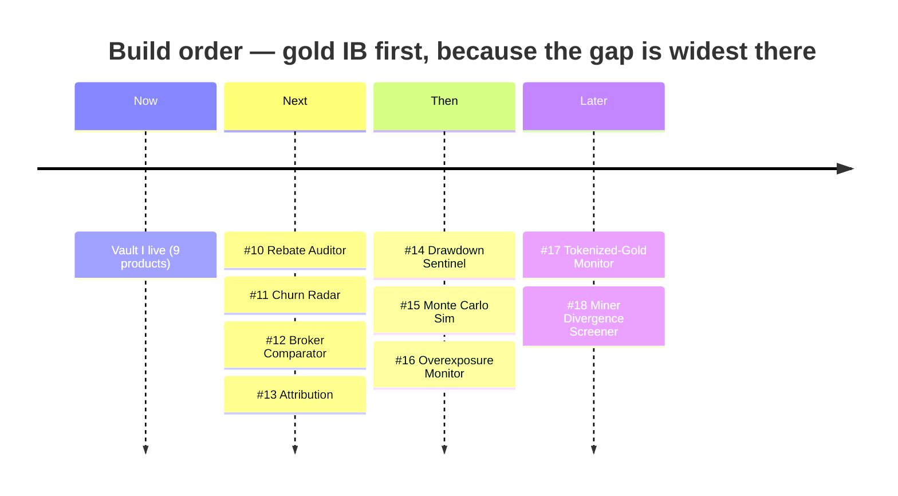
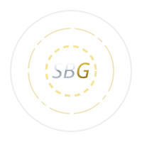

<div align="center">

<picture>
  <source media="(prefers-color-scheme: dark)" srcset="assets/hero-banner-dark.svg">
  <source media="(prefers-color-scheme: light)" srcset="assets/hero-banner-light.svg">
  
</picture>

<br><br>


<br><br>

<a href="#-the-vault--9-shipped"></a>
<a href="#-vault-ii--9-proposed"></a>
<a href="#-platforms--free-tiers"></a>
<a href="#-roadmap"></a>
<a href="#-quickstart"></a>

<br><br>



</div>

<br>

> [!IMPORTANT]
> **Educational research only. Not financial advice.** Every price, spread, and payout figure is indicative — verify with your broker before acting. Nothing here is a solicitation to trade, and no product guarantees a result.


<br>

## ⚡ What This Is

Eighteen small, sharp tools for people who make money **around** trading, not only from it — introducing brokers, prop-challenge traders, signal buyers, and gold watchers.

Every product follows the same shape: **one job, a Telegram command *and* a dashboard page, a free tier that needs no card, and a paid tier that only sells time and scale.** One Telegram account signs you in to both halves. Nine are shipped. Nine are proposed, weighted hard toward the gold-IB business, which is where the demand is loudest and the supply is thinnest.


<br>

## 🏆 The Vault — 9 Shipped

<div align="center">

| | | |
|:--:|:--:|:--:|
| <br>**Gold Watch Alert**<br>🤖🌐 Both | <br>**XAUUSD Verifier**<br>🤖🌐 Both | <br>**Prop Calculator**<br>🤖🌐 Both |
| <br>**Scam Detector**<br>🤖🌐 Both | <br>**Gold Calendar**<br>🤖🌐 Both | <br>**Copy-Trade Audit**<br>🤖🌐 Both |
| <br>**Red-Flag Scanner**<br>🤖🌐 Both | <br>**IB Revenue Calc**<br>🤖🌐 Both | <br>**Influencer Audit**<br>🤖🌐 Both |

</div>

<br>

<details>
<summary><b>🥇 #1 · Gold Watch Alert Bot</b> &nbsp;—&nbsp; 🤖🌐 Both &nbsp;·&nbsp; <i>free, unlimited</i></summary>

<br>

**Problem** — Traders miss gold entries to spread and slippage. Most Telegram gold channels are scams.

**Solution** — `/watch XAUUSD style mode`, moved from PRO to **free**. Binance `PAXGUSDT` primary, Yahoo `GC=F` fallback. Spread-aware stops from existing constants.

**Platform** — 🤖🌐 **Both.** 🤖 `/watch XAUUSD`, `/watch list` &nbsp;·&nbsp; 🌐 `/p/gold-watch` — Alert history · Threshold editor for each armed pair · CSV export of triggers for journalling.

**Primary** — 🤖 bot-led. One command in, one alert out — the dashboard keeps the history a chat log cannot.

**Free tier** — `/watch` on gold, unlimited, no account.

**Upsell** — `/autopilot` plus DCF/COT fundamentals as PRO.

</details>

<details>
<summary><b>🥇 #2 · XAUUSD Signal Verifier</b> &nbsp;—&nbsp; 🤖🌐 Both &nbsp;·&nbsp; <i>free single verify</i></summary>

<br>

**Problem** — Gold signal sellers post fabricated MT4 screenshots with cherry-picked entries.

**Solution** — `/verify GOLD PRICE` pulls Binance `PAXGUSDT` tick history and tests the claimed fill. Returns **VERDICT: REAL / IMPOSSIBLE** with the gap percentage and a plain-language reason.

**Platform** — 🤖🌐 **Both.** 🤖 `/verify GOLD PRICE` &nbsp;·&nbsp; 🌐 `/p/signal-verifier` — Verdict archive with the tick window that produced each call · Batch verify · Shareable public verdict link for posting back into a group.

**Primary** — 🤖 bot-led. Verification belongs in the group where the fake was posted.

**Free tier** — one verify per request, unlimited requests.

**Upsell** — PRO batch CSV upload and weekly audit reports.

</details>

<details>
<summary><b>🏛 #3 · Prop Firm Challenge Calculator</b> &nbsp;—&nbsp; 🤖🌐 Both &nbsp;·&nbsp; <i>full calculator free</i></summary>

<br>

**Problem** — Traders pay $500–$5,000 in challenge fees with no expected-value estimate, and roughly 90% fail. Hidden rules sit buried in the T&Cs.

**Solution** — Flask calculator plus `/propcalc FEE SIZE PASS%`. Computes EV and scans pasted T&Cs for hidden rules with red/yellow scoring.

**Platform** — 🤖🌐 **Both.** 🤖 `/propcalc FEE SIZE PASS%` &nbsp;·&nbsp; 🌐 `/p/prop-calculator` — Full calculator with the long T&C paste box · Rule-scan report, red and yellow flags itemised · Saved comparisons across firms.

**Primary** — 🌐 dashboard-led. The long T&C paste needs a page; the bot answers the quick yes-or-no.

**Free tier** — full calculator and bot command, no limit.

**Upsell** — premium PDF audit and automated forecast.

</details>

<details>
<summary><b>🔒 #4 · Telegram Bot Scam Detector</b> &nbsp;—&nbsp; 🤖🌐 Both &nbsp;·&nbsp; <i>free scans</i></summary>

<br>

**Problem** — Fake verification bots, malware links, and fake airdrops rose sharply through 2025.

**Solution** — `/audit @bot_username` checks for private-key requests, unregulated broker pushes, and missing audit links. Returns a **SCAM SCORE** and a checklist.

**Platform** — 🤖🌐 **Both.** 🤖 `/audit @bot_username` &nbsp;·&nbsp; 🌐 `/p/bot-scam-detector` — Scan history with the score breakdown per signal · Watchlist of bots to re-scan · Public scam-score page per audited bot.

**Primary** — 🤖 bot-led. It audits Telegram bots, so it lives where its targets live.

**Free tier** — unlimited `/audit` scans.

**Upsell** — PRO daily auto-scan of subscribed channels plus a malware database.

</details>

<details>
<summary><b>🥇 #5 · Gold Seasonality Calendar</b> &nbsp;—&nbsp; 🤖🌐 Both &nbsp;·&nbsp; <i>calendar + PDF free</i></summary>

<br>

**Problem** — Traders ignore gold seasonality — Fed windows, CME holidays, jewelry cycles — and the spread-widening events around them.

**Solution** — Web calendar at `/gold-calendar` showing monthly volatility patterns and Fed release windows, with PDF download. Bot pushes `/calendar_alert` 30 minutes ahead.

**Platform** — 🤖🌐 **Both.** 🤖 `/calendar`, `/calendar_alert` &nbsp;·&nbsp; 🌐 `/p/gold-calendar` — Month grid of volatility patterns and Fed release windows · PDF download of the current quarter · Per-event history.

**Primary** — 🌐 dashboard-led. The calendar is a page you scan; the bot is the push you cannot miss.

**Free tier** — full calendar and PDF, no login.

**Upsell** — PRO real-time alert bot.

</details>

<details>
<summary><b>🔒 #6 · Copy-Trade Safety Audit</b> &nbsp;—&nbsp; 🤖🌐 Both &nbsp;·&nbsp; <i>5 free audits</i></summary>

<br>

**Problem** — Influencers push unregulated copy-trading; users lose capital to hidden spreads and blowouts.

**Solution** — `/copyaudit BROKER` checks regulation (SEC/FCA/ASIC links) and negative-balance protection, and prices the hidden spread cost. Returns **SAFE / HIGH RISK** with a checklist.

**Platform** — 🤖🌐 **Both.** 🤖 `/copyaudit BROKER` &nbsp;·&nbsp; 🌐 `/p/copy-trade-audit` — Audit history with the regulator links that were checked · Side-by-side broker comparison · Hidden-cost model.

**Primary** — 🤖 bot-led. It has to run at the moment someone is being pitched.

**Free tier** — 5 audits.

**Upsell** — PRO unlimited plus a weekly portfolio risk report.

</details>

<details>
<summary><b>💱 #7 · Forex Signal Red-Flag Scanner</b> &nbsp;—&nbsp; 🤖🌐 Both &nbsp;·&nbsp; <i>free text scan</i></summary>

<br>

**Problem** — Signal sellers claim "100% accuracy", delete losing trades, flood fake reviews, and charge $30–$300 a month.

**Solution** — Web scanner plus `/scan TEXT`. NLP flags "guaranteed", "no risk", "VIP spots left", and checks for verified audit links (MyFXBook / FX Blue).

**Platform** — 🤖🌐 **Both.** 🤖 `/scan TEXT` &nbsp;·&nbsp; 🌐 `/p/red-flag-scanner` — Scanner with the full pitch pasted in, flags highlighted inline · Scan history per seller or channel · Weekly scorecard for a channel you follow.

**Primary** — 🤖 bot-led. Pitches arrive in chat, so the scan starts there.

**Free tier** — unlimited text scans.

**Upsell** — PRO full group auto-scan and a weekly scorecard.

</details>

<details>
<summary><b>🥇 #8 · IB Affiliate Revenue Calculator</b> &nbsp;—&nbsp; 🤖🌐 Both &nbsp;·&nbsp; <i>free calculator</i></summary>

<br>

**Problem** — IB affiliates face opaque payout rules and compliance overhead, and referred clients complain about buggy platforms and slow withdrawals.

**Solution** — Web calculator at `/ib-calc` estimating net revenue after compliance cost and payout timeline, with a downloadable compliance checklist.

**Platform** — 🤖🌐 **Both.** 🤖 `/ibcalc LOTS RATE` &nbsp;·&nbsp; 🌐 `/p/ib-revenue-calculator` — Multi-field revenue model with the payout timeline · Downloadable compliance checklist · Saved scenarios across brokers.

**Primary** — 🌐 dashboard-led. A multi-field model and a document download; the bot gives the quick estimate.

**Free tier** — full calculator and checklist.

**Upsell** — PRO automated monthly forecast and audit template.

</details>

<details>
<summary><b>🔒 #9 · Influencer Trading Scam Audit</b> &nbsp;—&nbsp; 🤖🌐 Both &nbsp;·&nbsp; <i>free audit + template</i></summary>

<br>

**Problem** — Billions are lost to social-media investment scams each year, and a large share of short-form "financial advice" is misleading.

**Solution** — `/audit @influencer_handle` demands audited trading history rather than screenshots, flags rented luxury props, and checks unregulated broker promotions. Ships a free **loss report template** for FTC / CFTC / IC3.

**Platform** — 🤖🌐 **Both.** 🤖 `/influencer @handle` &nbsp;·&nbsp; 🌐 `/p/influencer-audit` — Audit archive, shareable per handle · Loss-report template generator for FTC / CFTC / IC3 · Broker-promotion trail for the accounts you have audited.

**Primary** — 🤖 bot-led. Viral by construction — the audit gets forwarded into the group that shared the influencer.

**Free tier** — unlimited audits plus the loss-report template.

**Upsell** — PRO batch audit and an automated scam-alert channel.

</details>


<br>

## 🔮 Vault II — 9 Proposed

The shipped nine are almost all **defensive** — auditors, verifiers, red-flag scanners — plus two static calculators. Nothing yet serves an introducing broker's *actual daily operations*. Vault II fixes that, weighted **4 gold IB / 2 prop / 1 forex / 1 crypto / 1 stocks**.

Scored on what matters: how badly people want it, versus how little exists today.

<div align="center">

| | # | Product | Vertical | Platform | Free tier | Demand | Supply gap | Effort |
|:--:|:--|:--|:--|:--|:--|:--|:--|:--|
|  | **10** | Rebate Reconciliation Auditor | 🥇 Gold IB | 🤖🌐 Both | 1 broker · 1 month | `●●●●●` | `○○○○○` | ●●○ |
|  | **11** | IB Client Churn & Blow-Up Radar | 🥇 Gold IB | 🤖🌐 Both | 10 clients | `●●●●○` | `○○○○○` | ●●● |
|  | **12** | Live Gold Broker Comparator | 🥇 Gold IB | 🤖🌐 Both | fully open | `●●●●○` | `●●○○○` | ●●○ |
|  | **13** | IB Link Attribution Tracker | 🥇 Gold IB | 🤖🌐 Both | 3 links | `●●●○○` | `●○○○○` | ●●○ |
|  | **14** | Drawdown Sentinel | 🏛 Prop | 🤖🌐 Both | 1 account · 1 firm | `●●●●●` | `●○○○○` | ●●● |
|  | **15** | Monte Carlo Challenge Sim | 🏛 Prop | 🤖🌐 Both | 1,000 sims | `●●●●○` | `●●○○○` | ●○○ |
|  | **16** | Correlation & Overexposure | 💱 Forex | 🤖🌐 Both | snapshots | `●●●●○` | `●●○○○` | ●●○ |
|  | **17** | Tokenized-Gold Premium Monitor | 🪙 Crypto | 🤖🌐 Both | unlimited | `●●●○○` | `○○○○○` | ●○○ |
|  | **18** | Miner–Bullion Divergence Screener | 📈 Stocks | 🤖🌐 Both | weekly screen | `●●●○○` | `●○○○○` | ●●○ |

<sub>`●` demand = how loudly it is asked for &nbsp;·&nbsp; `○` supply gap = how little exists (more `○` = emptier market) &nbsp;·&nbsp; effort = build weeks</sub>

</div>

<br>

<details>
<summary><b>🥇 #10 · Rebate Reconciliation Auditor</b> &nbsp;—&nbsp; 🤖🌐 Both &nbsp;·&nbsp; <b>the biggest gap in the set</b></summary>

<br>

**Problem** — Brokers underpay IB rebates and quietly change per-lot rates. Almost no IB reconciles, because doing it by hand across a few hundred accounts is miserable.

**Solution** — Upload the broker rebate statement CSV and the client trade log. Recompute `lots × rate` per symbol and account tier, diff it against what was actually paid, and flag shortfalls, missing accounts, and silent rate changes.

**Platform** — 🤖🌐 **Both.** 🤖 `/rebateaudit`, `/rebatestatus` &nbsp;·&nbsp; 🌐 `/p/rebate-auditor` — CSV upload for the broker statement and the client trade log · Sortable diff table · Dispute PDF with the per-account arithmetic shown.

**Primary** — 🌐 dashboard-led. CSV upload, a sortable diff, a dispute PDF; the bot pings when a run finishes.

**Free tier** — one broker, one month, full shortfall report. No card.

**Upsell** — multi-broker monthly auto-reconciliation and a dispute-letter generator.

**Data** — broker rebate statement, trade log export, IB tier schedule.

📄 [Full spec →](products/product-10.md)

</details>

<details>
<summary><b>🥇 #11 · IB Client Churn & Blow-Up Radar</b> &nbsp;—&nbsp; 🤖🌐 Both</summary>

<br>

**Problem** — IB revenue dies when the client book dies, and it dies quietly. By the time volume shows up flat in the monthly statement, the client is already gone.

**Solution** — Score every referred client on declining lot volume, rising margin utilisation, martingale and revenge-trade patterns, and dormancy drift. Output a 30-day churn or blow-up probability with a suggested intervention.

**Platform** — 🤖🌐 **Both.** 🤖 `/ibchurn`, `/ibchurn @client` &nbsp;·&nbsp; 🌐 `/p/churn-radar` — Book overview ranked by 30-day blow-up probability · Per-client signal breakdown and history · Intervention log.

**Primary** — 🌐 dashboard-led. The book is a table you study; the bot warns the moment a client crosses a line.

**Free tier** — 10 tracked clients, unlimited alerts.

**Upsell** — unlimited clients and auto-drafted nurture messages.

📄 [Full spec →](products/product-11.md)

</details>

<details>
<summary><b>🥇 #12 · Live Gold Broker Comparator</b> &nbsp;—&nbsp; 🤖🌐 Both &nbsp;·&nbsp; <i>doubles as the IB's lead magnet</i></summary>

<br>

**Problem** — An IB has to justify which broker they route clients to, and clients have no way to compare the numbers that actually cost them money.

**Solution** — Live XAUUSD spread, swap long and short, commission, and observed slippage across a broker set, rendered as a ranked shareable card carrying the IB's referral link.

**Platform** — 🤖🌐 **Both.** 🤖 `/goldspread`, `/goldspread 1.0 overnight` &nbsp;·&nbsp; 🌐 `/p/broker-comparator` — Public indexable comparison table · Cost calculator for a given lot size and holding period · Referral-branded card generator.

**Primary** — 🌐 dashboard-led. The public table is the SEO asset; the bot drops the card straight into a group.

**Free tier** — public comparison table and bot command, fully open.

**Upsell** — white-label branded embeddable widget.

📄 [Full spec →](products/product-12.md)

</details>

<details>
<summary><b>🥇 #13 · IB Link Attribution & Funnel Tracker</b> &nbsp;—&nbsp; 🤖🌐 Both</summary>

<br>

**Problem** — Broker portals report signups but never say where they came from, so an IB cannot tell which content earned the client.

**Solution** — Per-channel short links tracking post → click → signup → first deposit → first lot, closing the attribution hole the broker leaves open.

**Platform** — 🤖🌐 **Both.** 🤖 `/newlink CHANNEL`, `/funnel` &nbsp;·&nbsp; 🌐 `/p/link-attribution` — Link manager with per-channel tags · Funnel dashboard from click through to first lot · Channel comparison over a date range.

**Primary** — 🌐 dashboard-led. Link management and a funnel need a page; the bot mints links and reports daily.

**Free tier** — 3 tracked links, full funnel view.

**Upsell** — unlimited links, cohort LTV, and payback period.

📄 [Full spec →](products/product-13.md)

</details>

<details>
<summary><b>🏛 #14 · Drawdown Sentinel (Rule Guardian)</b> &nbsp;—&nbsp; 🤖🌐 Both</summary>

<br>

**Problem** — Most challenge failures are **rule breaches, not bad strategy** — a daily-loss line crossed by one trade, a news-window entry, a lot size over cap.

**Solution** — Real-time monitor of daily loss, trailing drawdown, news blackout windows, max lot, and consistency rules, driven by per-firm rule packs. It alerts *before* the breach, with an optional flatten webhook.

**Platform** — 🤖🌐 **Both.** 🤖 `/sentinel link`, `/sentinel status`, `/sentinel firm NAME` &nbsp;·&nbsp; 🌐 `/p/drawdown-sentinel` — Account linking and rule-pack selection · Live distance-to-breach gauges per rule · Breach history and near-miss log.

**Primary** — 🤖 bot-led. The entire value is a push arriving seconds before the line is crossed.

**Free tier** — 1 account on 1 firm, unlimited breach alerts.

**Upsell** — multi-account monitoring and auto-flatten.

📄 [Full spec →](products/product-14.md)

</details>

<details>
<summary><b>🏛 #15 · Monte Carlo Challenge Simulator</b> &nbsp;—&nbsp; 🤖🌐 Both</summary>

<br>

**Problem** — Product #3 gives a static EV number, which hides the thing that actually kills accounts: path risk. A profitable edge still breaches a trailing drawdown on a bad sequence.

**Solution** — Simulate N equity paths against the *real* rule set — daily DD, trailing DD, minimum trading days, consistency rule — from the trader's own win rate, RR, and variance. Return a realistic pass probability and the expected total cost-to-funded across retries.

**Platform** — 🤖🌐 **Both.** 🤖 `/simulate WINRATE RR RISK%` &nbsp;·&nbsp; 🌐 `/p/monte-carlo-sim` — Equity-path fan chart across the simulated runs · Rule-pack picker · PDF export of the run.

**Primary** — 🌐 dashboard-led. The fan chart and the PDF need a page; the bot returns the summary card.

**Free tier** — 1,000 simulations per run, unlimited runs.

**Upsell** — 100k sims, full rule-pack library, PDF export.

📄 [Full spec →](products/product-15.md)

</details>

<details>
<summary><b>💱 #16 · Correlation & Overexposure Monitor</b> &nbsp;—&nbsp; 🤖🌐 Both</summary>

<br>

**Problem** — "Five open trades" is often one leveraged bet. XAUUSD, silver, DXY, USDJPY, and miners move together, and the account finds out during the drawdown.

**Solution** — Cluster open positions into a single true-risk figure, and surface swap-rollover and session-spread cost alongside it.

**Platform** — 🤖🌐 **Both.** 🤖 `/exposure`, `/exposure warn` &nbsp;·&nbsp; 🌐 `/p/exposure-monitor` — Correlation heat-map of the open book · True-risk figure with the cluster decomposition · Rollover and session-spread cost projection.

**Primary** — 🤖 bot-led. Overexposure is a warning you need immediately; the heat-map explains it afterwards.

**Free tier** — on-demand snapshots, unlimited.

**Upsell** — live monitoring with prop-rule-aware exposure caps.

📄 [Full spec →](products/product-16.md)

</details>

<details>
<summary><b>🪙 #17 · Tokenized-Gold Premium & Payout Health Monitor</b> &nbsp;—&nbsp; 🤖🌐 Both</summary>

<br>

**Problem** — PAXG and XAUT drift from spot XAU, and nobody watches the premium. Separately, traders taking IB and prop payouts in USDT get hit by chain fees, depeg moments, and address-poisoning attacks.

**Solution** — Track tokenized-gold premium and discount against spot, redemption fees, and reserve-attestation freshness. Add a payout-wallet health check: chain fee, depeg watch, address-poisoning detection.

**Platform** — 🤖🌐 **Both.** 🤖 `/paxg`, `/walletcheck ADDRESS` &nbsp;·&nbsp; 🌐 `/p/tokenized-gold` — Public premium/discount chart over time · Reserve attestation freshness per token · Payout wallet health report.

**Primary** — 🤖 bot-led. Depeg and poisoning checks are alerts; the premium chart is a page.

**Free tier** — live premium readout and wallet safety check, unlimited.

**Upsell** — arbitrage alerts and continuous wallet monitoring.

📄 [Full spec →](products/product-17.md)

</details>

<details>
<summary><b>📈 #18 · Miner–Bullion Divergence Screener</b> &nbsp;—&nbsp; 🤖🌐 Both</summary>

<br>

**Problem** — Gold traders who want equity exposure are badly served. Generic stock screeners know nothing about AISC, and gold sites know nothing about equities.

**Solution** — Screen GDX, GDXJ, and royalty names for beta divergence against spot gold, AISC-versus-price margin compression, and earnings or halt risk.

**Platform** — 🤖🌐 **Both.** 🤖 `/miners`, `/miners TICKER` &nbsp;·&nbsp; 🌐 `/p/miner-divergence` — Sortable screener table across the miner universe · Per-name divergence chart against spot gold · AISC margin and earnings/halt risk panel.

**Primary** — 🌐 dashboard-led. A sortable screener is a table; the bot carries the weekly digest.

**Free tier** — weekly screen, full table, no login.

**Upsell** — daily alerts and backtesting.

📄 [Full spec →](products/product-18.md)

</details>


<br>

## 📊 Platforms & Free Tiers

<div align="center">

<picture>
  <source media="(prefers-color-scheme: dark)" srcset="assets/metrics-3d-dark.svg">
  <source media="(prefers-color-scheme: light)" srcset="assets/metrics-3d-light.svg">
  
</picture>

</div>

<br>

**Every product ships both surfaces.** One Telegram account signs you in to the
dashboard, so the bot and the page always agree on who you are and what you are
entitled to.

| Half | Always gives you | Never |
|:--|:--|:--|
| 🤖 **Telegram** | At least one slash command that returns the product's core answer, plus push alerts wherever the product has a trigger | A paywall at the door |
| 🌐 **Dashboard** | A page at `/p/<slug>`: run history, configuration, export, a shareable link | A second login |

Shape no longer decides *whether* a surface exists — only which one is **primary**,
meaning where the value actually lands. That marker is kept on every product below,
because it is real information: a breach alert is worthless on a page you are not
looking at, and a sortable diff table is unreadable in a chat window.

<div align="center">

| # | Product | 🤖 Telegram | 🌐 Dashboard | Primary | Free tier |
|:--|:--|:--|:--|:--:|:--|
| 🥇 **1** | Gold Watch Alert | `/watch XAUUSD` | `/p/gold-watch` | 🤖 | Unlimited /watch on gold. No account |
| 🥇 **2** | XAUUSD Signal Verifier | `/verify GOLD PRICE` | `/p/signal-verifier` | 🤖 | One verify per request, unlimited requests |
| 🏛 **3** | Prop Firm Challenge Calculator | `/propcalc FEE SIZE PASS%` | `/p/prop-calculator` | 🌐 | Full calculator and bot command, no limit |
| 🔒 **4** | Telegram Bot Scam Detector | `/audit @bot_username` | `/p/bot-scam-detector` | 🤖 | Unlimited /audit scans |
| 🥇 **5** | Gold Seasonality Calendar | `/calendar` | `/p/gold-calendar` | 🌐 | Full calendar and PDF, no login |
| 🔒 **6** | Copy-Trade Safety Audit | `/copyaudit BROKER` | `/p/copy-trade-audit` | 🤖 | 5 audits free |
| 💱 **7** | Forex Signal Red-Flag Scanner | `/scan TEXT` | `/p/red-flag-scanner` | 🤖 | Unlimited text scans |
| 🥇 **8** | IB Affiliate Revenue Calculator | `/ibcalc LOTS RATE` | `/p/ib-revenue-calculator` | 🌐 | Full calculator and compliance checklist |
| 🔒 **9** | Influencer Trading Scam Audit | `/influencer @handle` | `/p/influencer-audit` | 🤖 | Unlimited audits plus the loss-report template |
| 🥇 **10** | Rebate Reconciliation Auditor | `/rebateaudit` | `/p/rebate-auditor` | 🌐 | One broker, one month, full shortfall report. No card |
| 🥇 **11** | IB Client Churn & Blow-Up Radar | `/ibchurn` | `/p/churn-radar` | 🌐 | 10 tracked clients, unlimited alerts |
| 🥇 **12** | Live Gold Broker Comparator | `/goldspread` | `/p/broker-comparator` | 🌐 | Public comparison table and bot command, fully open |
| 🥇 **13** | IB Link Attribution & Funnel Tracker | `/newlink CHANNEL` | `/p/link-attribution` | 🌐 | 3 tracked links, full funnel view |
| 🏛 **14** | Drawdown Sentinel | `/sentinel link` | `/p/drawdown-sentinel` | 🤖 | 1 account on 1 firm, unlimited breach alerts |
| 🏛 **15** | Monte Carlo Challenge Simulator | `/simulate WINRATE RR RISK%` | `/p/monte-carlo-sim` | 🌐 | 1,000 simulations per run, unlimited runs |
| 💱 **16** | Correlation & Overexposure Monitor | `/exposure` | `/p/exposure-monitor` | 🤖 | On-demand snapshot, unlimited |
| 🪙 **17** | Tokenized-Gold Premium & Payout Health | `/paxg` | `/p/tokenized-gold` | 🤖 | Live premium readout and wallet safety check, unlimited |
| 📈 **18** | Miner–Bullion Divergence Screener | `/miners` | `/p/miner-divergence` | 🌐 | Weekly screen, full table, no login |

</div>

<div align="center">

| | Count |
|:--|:--:|
| 🤖🌐 Both surfaces | **18 / 18** |
| 🤖 Bot-led | **9** |
| 🌐 Dashboard-led | **9** |
| ✅ Free tier, no card | **18 / 18** |

</div>

> [!NOTE]
> **No product is paywalled at the door.** Every one of the eighteen does its core job for free, without a card. Paid tiers sell only *scale* (more clients, more sims, more brokers) and *automation* (continuous monitoring instead of on-demand).


<br>

## 🗺️ Roadmap

<div align="center">



</div>

- [x] **Phase 0 — the spine** — one Flask app, a page per product, one Telegram identity across bot and dashboard
- [x] **Vault I** — 9 products shipped
- [ ] **Gold IB ops suite** — #10 Rebate Auditor, #11 Churn Radar, #12 Broker Comparator, #13 Attribution
- [ ] **Prop + forex** — #14 Drawdown Sentinel, #15 Monte Carlo Sim, #16 Overexposure Monitor
- [ ] **Crypto + stocks** — #17 Tokenized-Gold Monitor, #18 Miner Divergence Screener
- [ ] One billing spine (Stripe + USDT) across all eighteen




<br>

## 🚀 Quickstart

```bash
git clone https://github.com/printezy247/sambangold-products.git
cd sambangold-products
cp .env.example .env               # fill in your keys — never commit this file
pip install -r requirements.txt

flask --app wsgi run               # 🌐 dashboard on http://localhost:5000
pytest -q                          # the surface contract: both halves, all 18
```

The dashboard lists every product at `/`, and each one has its own page at
`/p/<slug>`. The 🤖 half is the same process — point Telegram at
`POST /webhook/telegram` once `PUBLIC_BASE_URL` is reachable over HTTPS.

| Variable | Required | Purpose |
|:--|:--:|:--|
| `TELEGRAM_BOT_TOKEN` | ✅ | Bot identity, and the key that signs dashboard logins |
| `FLASK_SECRET_KEY` | ✅ | Session signing for the 🌐 dashboard |
| `PUBLIC_BASE_URL` | ✅ | Where Telegram sends the webhook, and the base for shareable links |
| `STRIPE_API_KEY` | — | PRO tier checkout |
| `STRIPE_WEBHOOK_SECRET` | — | Subscription state sync |
| `USDT_ADDRESS` | — | Crypto payment path |
| `ADMIN_TELEGRAM_ID` | ✅ | Admin commands and alert routing |
| `EZYAI_SITE_URL` | — | Web base URL for shareable links |
| `SENTRY_DSN` | — | Error tracking |
| `EZYAI_DEMO_DATA` | — | Seed demo data (`true` / `false`) |

<details>
<summary><b>🛠 Deploy</b></summary>

<br>

CI runs on every push and pull request against `master` — the README/asset check, then `py_compile`, then pytest, then deploy to Fly.io on `master` pushes only. See [`.github/workflows/build-deploy.yml`](.github/workflows/build-deploy.yml).

```bash
fly deploy --remote-only
```

`FLY_API_TOKEN` must be set as a repository secret. Never commit `.env`.

</details>


<br>

## 🧱 Repo Map

```
sambangold-products/
├── assets/
│   ├── hero-banner-{dark,light}.svg    animated hero
│   ├── metrics-3d-{dark,light}.svg     isometric vertical breakdown
│   ├── divider-flow.svg                animated section rule
│   ├── stack-ticker.svg                scrolling stack marquee
│   ├── roadmap-orbit.svg               orbital roadmap
│   ├── badges-strip.svg                self-hosted badges
│   ├── nav/                            clickable section chips
│   └── icons/ic-01..18.svg             3D product icons
├── app/
│   ├── products.py                     the registry — 18 products, both halves
│   ├── auth.py                         Telegram Login Widget → web session
│   ├── telegram.py                     webhook + command dispatch
│   ├── views.py                        / and /p/<slug>
│   └── templates/                      dashboard pages
├── tests/                              surface contract + auth verification
├── products/product-01..18.md          per-product specs
├── scripts/                            check, commit and deploy helpers
├── wsgi.py                             gunicorn entry point
└── .github/workflows/build-deploy.yml  CI/CD
```


<div align="center">

<br>



### printezy · sambangold

<sub>Python · Flask · Telegram Bot API · Binance · Yahoo Finance · Stripe · Fly.io</sub>

<sub>**Educational research only. Not financial advice.** Verify every price with your broker.</sub>

<sub>MIT</sub>

<br>


</div>
